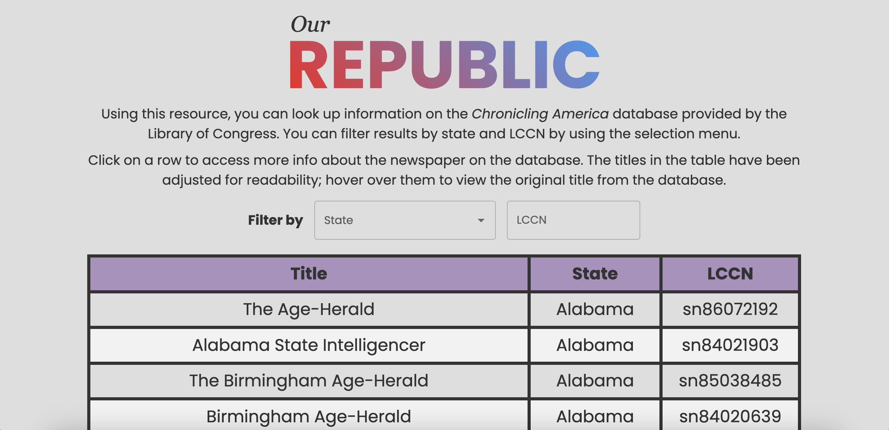

# React Level 3

In this challenge you will build an app using React that queries an API and displays them to demonstrate your skills in React.

## Requirements

In order for the project to be considered "completed", it must complete the following requirements:

1. **Visualize Data:** fetches data from an API ([free ones here](https://github.com/public-apis/public-apis?tab=readme-ov-file#index)) and renders the results in a table with paging.
2. **Leverages React Hooks:** uses `useState()` and `useEffect()` to manage variable changes and accessing API
3. **Git Best Practices:** hides all API Keys and secrets in a `.env` file and uses a `.gitignore` to prevent all unneccessary files from being added to the GitHub Repository. Also does not push `node_modules` as it is very large.

4. **CHOOSE ONE**

- **Store Users in Database:** Have a form that allows users to enter their emails to join your mailing list. Display this mailing list in a table.
- **Enable Download Data Functionality:** add ability to download the data table (all results of the API)

**See `MORE_INSTRUCTIONS.md` for a tips to get started**

## Example

See Adam Godel's Project [Our Republic](https://our-republic.vercel.app/) that uses the Library of Congress API to achieve the goals of this project! See his source code [here](https://github.com/adam-godel/our-republic).

## Submission

All code must be submitted as a [PR (pull request)](https://docs.github.com/en/pull-requests/collaborating-with-pull-requests/proposing-changes-to-your-work-with-pull-requests/creating-a-pull-request#creating-the-pull-request) following the PR template that will autogenerate when a PR is made

It may take Learning Ambassadors up to 1-2 weeks to grade your solution and give any feedback/badges associated with this challenge. However, if it takes longer than 2 weeks, please send an email to sparkttl@bu.edu.

## Contributing

See something in the docs that is unclear or think that this level 3 could use any more requirements? Please create a PR that follows the `open-src.md` template and we will get back to you!

<!-- PUT GOLD BADGE OF SKILL HERE -->
<!-- 

 -->
